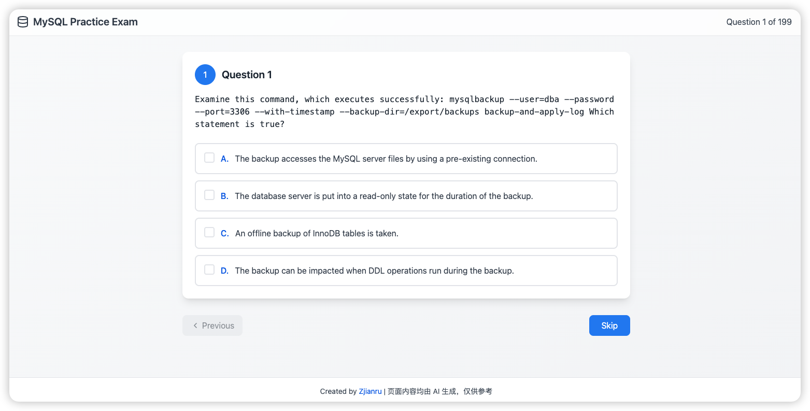

# MySQL 8.0 OCP 1Z0-908 练习题库

正值 MySQL 30 周年，官方开放了免费的认证渠道。本项目将 PDF 内的题目进行了结构化处理，形成了交互式刷题页面，帮助考生更好地准备 MySQL 8.0 OCP 认证考试。

## 题库来源

感谢国内的开源组织提供的原始题库：
[https://raw.gitcode.com/Open-source-documentation-tutorial/a0043/raw/main/MYSQL%20OCP%208.0%20%E9%A2%98%E5%BA%93.pdf](https://gitcode.com/Open-source-documentation-tutorial/a0043/blob/main/MYSQL%20OCP%208.0%20%E9%A2%98%E5%BA%93.pdf)

## 功能特点

- 📚 完整的 MySQL 8.0 OCP 1Z0-908 考试题库
- ✅ 支持单选题和多选题
- 🎯 实时答题反馈
- 📱 响应式设计，支持移动端访问
- 🔄 题目导航和进度追踪
- 💾 本地数据存储

## 页面预览



## 技术栈

- React 18
- TypeScript
- Tailwind CSS
- Framer Motion
- Vite
- Docker & Docker Compose
- GitHub Actions CI/CD

## 项目结构

```
├── public/                 # 静态资源目录
│   └── questions.json     # 题库数据文件
├── src/                   # 源代码目录
│   ├── components/        # React 组件
│   │   └── MySQLPracticeExam.tsx  # 主练习组件
│   ├── styles/           # 样式文件
│   └── App.tsx           # 应用入口
├── pdf_parse/            # PDF 解析工具
│   └── parse_pdf_to_json.py  # PDF 转 JSON 脚本
├── scripts/              # 构建脚本
│   ├── build.ps1         # Windows PowerShell 脚本
│   └── build.sh          # Linux/macOS Bash 脚本
├── .github/workflows/    # GitHub Actions 工作流
│   ├── docker-build-push.yml  # Docker 构建推送
│   ├── ci.yml            # 持续集成
│   └── deploy-pages.yml  # GitHub Pages 部署
├── Dockerfile            # 生产环境镜像
├── Dockerfile.dev        # 开发环境镜像
├── docker-compose.yml    # Docker Compose 配置
├── nginx.conf            # Nginx 配置
├── imgs/                 # 图片资源
├── package.json          # 项目依赖配置
├── DOCKER.md            # Docker 部署指南
└── README.md            # 项目文档
```

## 快速开始

### 方式一：Docker 部署（推荐）

```bash
# 使用 Docker Compose 一键启动
docker-compose up -d

# 访问应用：http://localhost:8080
```

详细的 Docker 部署说明请参考 [DOCKER.md](./DOCKER.md)

### 方式二：本地开发

1. 克隆项目
```bash
git clone [项目地址]
cd MySQL-8.0-OCP-1Z0-908
```

2. 安装依赖
```bash
npm install
```

> 如遇依赖安装缓慢，可使用国内镜像源（如 cnpm、pnpm 或 yarn）。

3. 启动开发服务器
```bash
npm run dev
```

4. 访问应用
打开浏览器访问 http://localhost:3000 即可使用刷题页面。

## 开发说明

### PDF 解析工具

项目包含一个 Python 脚本用于将 PDF 格式的题库转换为 JSON 格式。使用方法：

1. 确保已安装 Python 3.8+ 和必要的依赖：
```bash
pip install -r pdf_parse/requirements.txt
```

2. 运行解析脚本：
```bash
python pdf_parse/parse_pdf_to_json.py
```

### 构建生产版本

#### 本地构建
```bash
npm run build
```

构建后的文件将生成在 `dist` 目录中。

#### Docker 构建
```bash
# Windows
.\scripts\build.ps1 build

# Linux/macOS
./scripts/build.sh build
```

## Docker 部署

本项目提供完整的 Docker 化解决方案，支持：

- 🐳 多阶段构建优化镜像大小
- 🔄 开发环境热重载支持
- 🚀 生产环境 Nginx 优化
- 📦 GitHub Actions 自动构建推送
- 🛠️ 跨平台构建脚本

详细使用方法请查看 [DOCKER.md](./DOCKER.md)

## 注意事项

- 题库数据仅供参考，建议结合官方文档进行学习
- 部分题目可能存在多个正确答案，请仔细阅读题目要求
- 建议使用最新版本的 Chrome 或 Firefox 浏览器访问

## 贡献指南

欢迎提交 Issue 和 Pull Request 来帮助改进项目。

## 许可证

MIT License
